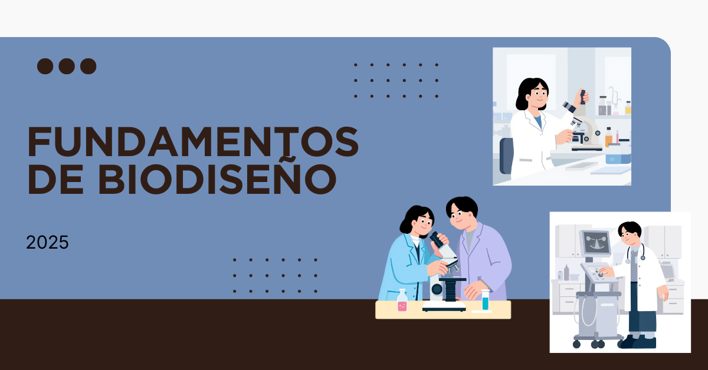
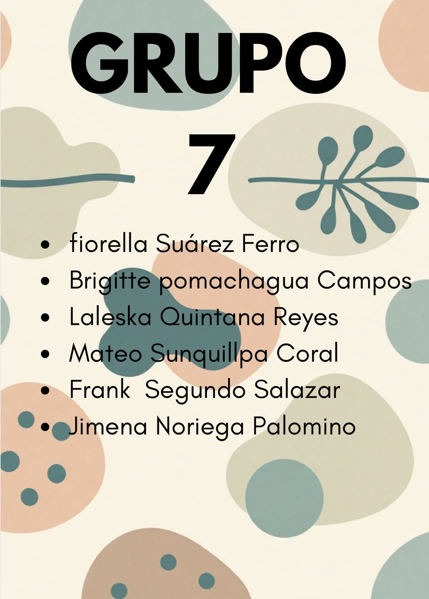

# Fundamentos de Biodiseño – Grupo 07 

  

  

📸 **Foto de Grupo** 

  

👩‍🔬**Sobre nosotros**

Somos el Grupo 07 de Fundamentos de Biodiseño, conformado por estudiantes universitarios comprometidos con el aprendizaje y la innovación.  

> 🎯 **Misión:** Integrar los conocimientos de ciencias básicas y diseño con una mirada **creativa y crítica**.  
> 🌍 **Visión:** Proponer **soluciones sostenibles** a los retos que enfrenta la salud y la sociedad actual.  
> 💡 **Objetivo:** Aprender, aplicar y **crear impacto real** mediante el biodiseño.

📚 **Durante el curso buscamos** 

- 🧠 *Adquirir bases teóricas sólidas* .  
- 🤝 *Desarrollar habilidades de trabajo en equipo, análisis y aplicación práctica*.  
- 🚀 *Formarnos como profesionales preparados para afrontar los futuros desafíos de la ingeniería biomédica** 
  
👥 **Integrantes**   

<table>
  <tr>
    <td width="150px"></td>
    <td>
      <b>Mateo Suquillpa<b>  
       Edad:  19
       Hábito:   Ver series
       <i>"Aprobar"</i>  
       <b>Rol:</b> Lider 
    </td>
  </tr>
</table>

---

<table>
  <tr>
    <td width="150px"></td>
    <td>
      <b>integrante: Frank Oliver Segundo Salazar  
       Edad: 20
       Hábito: Dormir
       <i>"Divertirse"</i>  
       <b>Rol:</b> Secretario
    </td>
  </tr>
</table>

---

<table>
  <tr>
    <td width="150px"></td>
    <td>
      <b>integrante: Fiorella Suarez Ferro  
       Edad: 19
       Hábito: practicar gimnasia
       <i>"Espero poder crear un proyecto innovador"</i>  
       <b>Rol:</b> Diseño
    </td>
  </tr>
</table>

---

<table>
  <tr>
    <td width="150px"></td>
    <td>
      <b>integrante: Brigitte Pomachagua Campos
       Edad:   
       Hábito:  
       <i>"lo que espera del curso"</i>  
       <b>Rol:</b> Documentación
    </td>
  </tr>
</table>

---

<table>
  <tr>
    <td width="150px"></td>
    <td>
      <b>integrante: Jimena Nathaly Noriega Palomino
       Edad: 
       Hábito: 
       <i>"Lo que espera del cuaro"</i>  
       <b>Rol:</b> Organización
    </td>
  </tr>
</table>

---

<table>
  <tr>
    <td width="150px"></td>
    <td>
      <b>integrante: Edgar Gonzales 
       Edad: 
       Hábito:  
       <i>"lo que espero del curso"</i>  
       <b>Rol:</b> Logistica
    </td>
  </tr>
</table>

---

<table>
  <tr>
    <td width="150px"></td>
    <td>
      <b>integrante: 
       Edad: 
       Hábito:  
       <i>"lo que espero del curso"</i>  
       <b>Rol:</b> Logistica
    </td>
  </tr>
</table>

✨ **Compromiso del Grupo** 

*Estamos convencidos de que la innovación nace del trabajo colaborativo.*  
*Nuestro reto es diseñar soluciones creativas que mejoren la salud y la calidad de vida.* 

*Grupo 07 – Fundamentos de Biodiseño*        📍 *Universidad Peruana Cayetano Heredia – 2026* 
